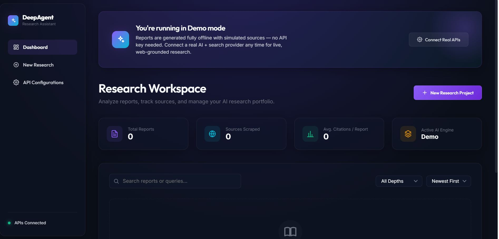
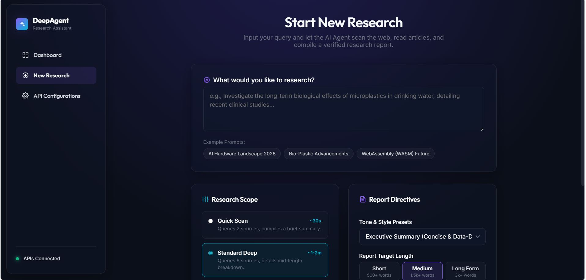
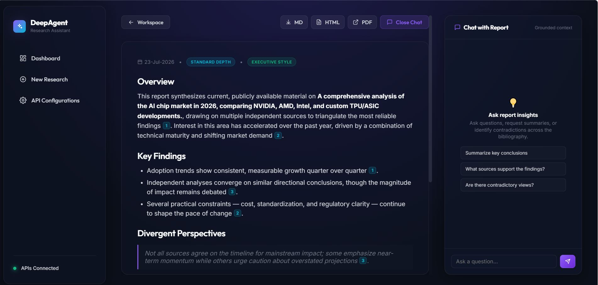
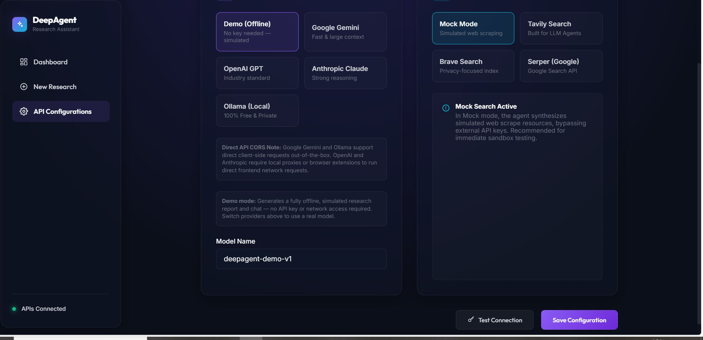

# Synthesize – AI Research Assistant

Synthesize is an AI-powered research assistant designed to streamline product research, competitive analysis, and insight generation. It provides an intuitive workspace for organizing research, analyzing customer reviews, comparing competitors, and exploring product features using multiple AI providers through a Bring Your Own AI (BYOAI) approach.

## Features

- AI-powered research workspace
- Interactive research dashboard
- Competitor Matrix for side-by-side analysis
- Review Analyzer for extracting insights from customer feedback
- Feature Canvas for organizing and comparing product features
- Bring Your Own AI (BYOAI) configuration
- Support for multiple AI providers
- Clean and responsive user interface
- Modern single-page application

---

## Technologies Used

- HTML5
- CSS3
- JavaScript (ES6+)

---

## Project Structure

```

---

## Screenshots

### Dashboard



### Competitor Matrix



### Review Analyzer



### Feature Canvas


### BYOAI Settings



---


---

## Future Improvements

- Export research reports
- Save research history
- Team collaboration
- Additional AI provider integrations
- Advanced filtering and search
- Authentication and user accounts

---

## License

This project is licensed under the MIT License.

---
